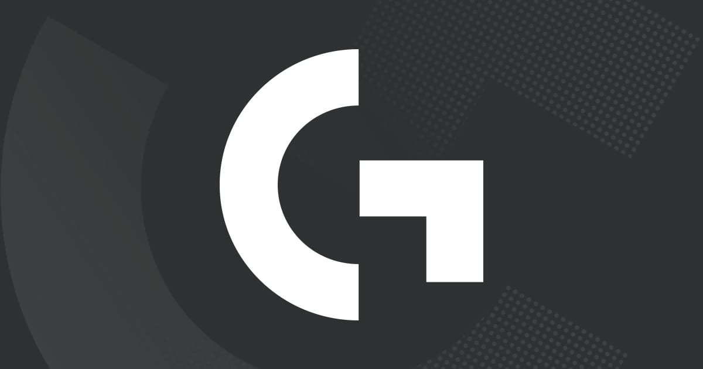
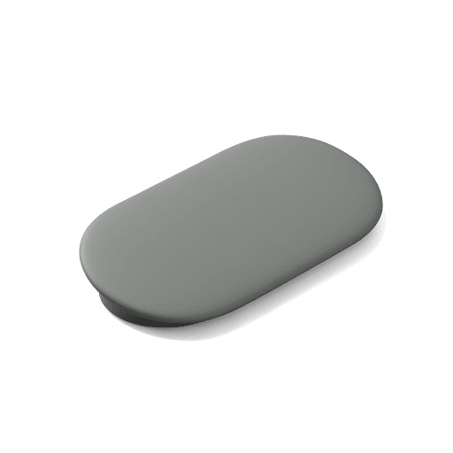
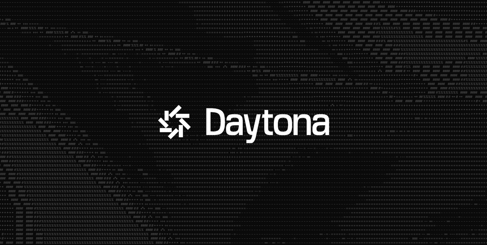
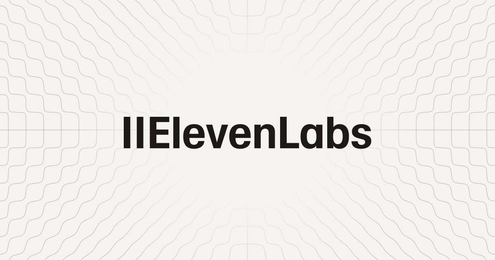
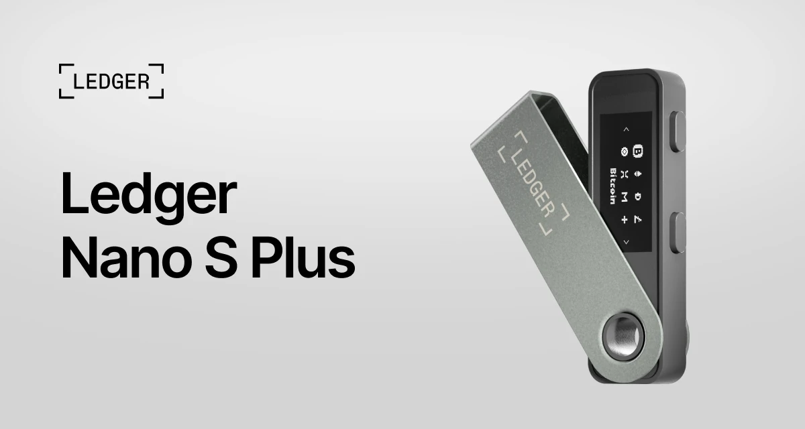
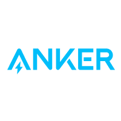

<!-- markdownlint-disable MD033 -->
# HackDavis 2026 — Prize Tracks

## 一、HackDavis 自评（General / Technical / Design / Business）

### MLH Best Hack for Social Good

- **奖品**：1st — [2026 MacBook Neo](https://www.apple.com/shop/buy-mac)；2nd — Electric Scooter
- **评审标准**：项目要体现你对 "social good" 的真实理解。**所有提交项目自动参评**，无需额外勾选。

### Hacker's Choice Award

- **奖品**：HackDavis Swag Bag（Tote、贴纸、钥匙扣）
- **评审标准**：由 2026 届 hacker 投票产生。所有项目自动参评；可投除自己以外的任意项目。

### Most Technically Challenging Hack

- **奖品**：AULA F75 75% 无线机械键盘
- **评审标准**：展示技术广度与应用——高级算法/数据结构、多技术栈集成、实现质量、技术深度，按性能与可扩展性打分。

### Best Beginner Hack

- **奖品**：24 寸显示器
- **评审标准**：**团队全员需为首次参加 hackathon**。展示成长、创造力、协作、坚持构建技能。

### Best Interdisciplinary Hack

- **奖品**：[$50 Amazon 礼卡](https://www.amazon.com/gift-cards)
- **评审标准**：跨学科视角融合，**至少一位成员非 CS/CSE 等计算机相关专业**才可参评。

### Most Creative Hack

- **奖品**：Mini Projector
- **评审标准**：原创性、跳出框架的思考、对观众的吸引力。

### Best Hardware Hack

- **奖品**：[Logitech G305 Lightspeed 无线游戏鼠标](https://www.logitechg.com/en-us/shop/p/g305-lightspeed-wireless-gaming-mouse.910-005280)
- **评审标准**：项目要有效集成硬件组件，最终成品需 functional、user-friendly、interactive。

### Best Hack for Social Justice

- **奖品**：[Google TV Streamer 4K](https://store.google.com/us/product/google_tv_streamer)
- **评审标准**：项目需切入种族不平等、经济不公、环境正义等社会议题，提供 tangible solutions 或提升相关意识。

### Best User Research

- **奖品**：[ChatGPT+（4 个月订阅）](https://openai.com/chatgpt/pricing/)
- **评审标准**：研究扎实、以用户为中心，包容性设计以最大化可访问性。

### Best Entrepreneurship Hack

- **奖品**：[North Face 双肩包](https://www.thenorthface.com/en-us/bags-backpacks)
- **评审标准**：**No Code Required**。聚焦商业可行性与说服力——产品/服务陈述、客户细分、分销渠道、收入/利润模型。

### Best Statistical Model

- **奖品**：蓝牙音箱
- **评审标准**：使用 EDA 引导建模假设；最终模型含显著性检验，并用 MSE / R² / 调整 R² / precision / recall 等指标评估，统计推理需对齐项目核心问题。

---

## 二、赞助商评审（Sponsor）

### Best AI/ML Hack — Sponsored by **Anthropic**

- **奖品**：[$750 Claude API credits](https://console.anthropic.com/)
- **评审标准**：独特/创意的 AI 功能，干净的数据，指标准确；使用相关算法 + ML 库和/或云平台；说明数据采集方式与"AI 如何模拟人类思维"；鼓励模型在未见过的场景下也能良好泛化。

### Best UI/UX Design — Sponsored by **Figma**

- **奖品**：[Sony WH-1000XM5 无线降噪耳机](https://electronics.sony.com/audio/headphones/headband/p/wh1000xm5-b)
- **评审标准**：使用 [Figma](https://www.figma.com/) 完成 wireframe；既好用又好看的网页体验；响应式设计；带来直观、愉悦的用户体验。

### Best Use of DAC Materials — Sponsored by **Davis Autonomy Club**

[Davis Autonomy Club（DAC）](https://www.davisautonomy.com/) 是 UC Davis 工学院的学生社团，专注做无人机、机械臂等自主机器人。这个 track 要求把视觉（摄像头/图片）+ AI 模型（VLM 或 VLA）+ 真实/仿真机器人闭环——简单说，让机器看懂图，然后真的动起来。

- **奖品**：[$10,000 Daytona infrastructure credits](https://www.daytona.io/)（Daytona 是"运行 AI 生成代码的安全云开发环境"）
- **评审标准**：必须使用一项或多项 DAC materials，构建 vision-based AI pipeline，实现/配置 VLM（Vision-Language Model）或 VLA（Vision-Language-Action Model），将真实视觉感知与机器人物理行为打通。
- **深入介绍**：[davis-autonomy-club.md](./davis-autonomy-club.md)

### Best Use of Reconstruct — Sponsored by **Reconstruct**

[Reconstruct](https://reconstructinc.com/) 是一家建筑科技公司，主打 **reality capture / 数字孪生**——用 360 相机、无人机、激光雷达扫工地，把扫描结果叠加 BIM 设计和施工进度做远程监控。HackDavis 现场会由他们的工程师提供数据集 / API 访问，开赛后第一时间去 booth 拿凭证。

- **奖品**：每位团队成员 $125 Visa 礼卡
- **评审标准**：在项目中以 prominent 且 efficient 的方式使用 Reconstruct，鼓励最具创意的用法。
- **深入介绍**：[reconstruct.md](./reconstruct.md)

---

## 三、MLH 评审的 Sponsor Tracks

> 这些奖项由 MLH 统一评审，需按 MLH 流程提交（一般会要求在 Devpost 勾选对应 prize）。

### Best Use of Gemini API — Google

- **奖品**：Google Swag Kits
- **评审标准**：用 [Google Gemini API](https://ai.google.dev/gemini-api/docs) 构建 AI 应用——聊天助手、研究论文摘要、创意内容生成（代码/脚本/音乐）等。

### Best Use of ElevenLabs

[ElevenLabs](https://elevenlabs.io/) 是当下最强的 AI 语音合成（TTS）+ 语音克隆 + 实时语音 Agent 平台之一。它的输出听起来像真人——情感、停顿、语气都自然——一行 API 就能让任何项目"开口说话"。

- **奖品**：无线耳机
- **评审标准**：用 ElevenLabs 生成自然、富有情感的 AI 语音，构建沉浸式音频体验（AI 伙伴、有声故事、语音应用），无需真人配音。
- **深入介绍**：[elevenlabs.md](./elevenlabs.md)

### Best Use of Solana

[Solana](https://solana.com/) 是一条公链（blockchain），定位"**速度极快、手续费极低**"——出块时间 ~400ms、单笔交易费 < $0.01。从开发者视角看，它就是一个特殊的"后端 + 数据库"，链上保存"谁拥有什么 / 发生过什么"的可信状态，特别适合高频小额交易、消费级应用、链上身份。

- **奖品**：[Ledger Nano S Plus](https://shop.ledger.com/products/ledger-nano-s-plus)（一个硬件加密钱包）
- **评审标准**：基于 Solana 高吞吐 / 低费用特性构建项目——高频交易游戏 / 社交 / 消费类应用、DeFi（交易/借贷/DEX）、供应链/身份/支付原型等。
- **深入介绍**：[solana.md](./solana.md)

### Best Use of Backboard

[Backboard](https://backboard.io/) 是一个面向 AI 应用的**统一 API + 持久记忆层**：把 LLM 默认"无状态/失忆"的痛点解决了——一个 SDK 同时给你长期记忆、RAG、embeddings、tool calls，背后还能路由到 17,000+ 个 LLM。

- **奖品**：[Tile Essentials Pack](https://www.tile.com/store/tile-essentials)（每位获奖成员一份蓝牙追踪器套装）
- **评审标准**：使用 Backboard 提供的 unified API（长期记忆 / RAG / embeddings / tool calls / 17,000+ LLM 路由 / 跨会话持久上下文）构建带状态的 AI 应用。
- **深入介绍**：[backboard.md](./backboard.md)

### Best Use of Vultr

[Vultr](https://www.vultr.com/) 是一家云基础设施商，对标 AWS/GCP/DigitalOcean，主打"60 秒一键开机 + 价格便宜 + 有 Cloud GPU"。Hackathon 期间最便宜的"把 demo 部署到公网 + 跑 GPU 训练"选项。

- **奖品**：便携显示屏
- **评审标准**：使用 Vultr 一键部署 / 可扩展云算力 / Cloud GPU 支撑高性能或 AI 应用；需注册 Vultr 账户并领取免费 credits（**注意：必须提交一张 Vultr profile 页面截图**才算完成挑战）。
- **深入介绍**：[vultr.md](./vultr.md)

### Best Use of MongoDB Atlas

- **奖品**：M5Stack IoT Kit（每位成员）
- **评审标准**：项目使用 [MongoDB Atlas](https://www.mongodb.com/atlas)（学生 $50 credit 或 free-forever tier）。

### Best Domain Name from GoDaddy Registry

- **奖品**：Digital Gift Card
- **评审标准**：使用 [GoDaddy Registry](https://registry.godaddy/) 注册域名。

---

## 四、非营利 / 社区合作（Non-Profit）

### Best Hack for Women's Center —— Wellspring

[Wellspring Women's Center](https://www.wellspringwomen.org/) 是 1987 年成立、位于 Sacramento 的女性 drop-in center，每个工作日为 ~200 位脆弱处境的女性和儿童提供餐食、咨询、案管理与安全网服务。完全靠捐赠运营，没有政府资助。

- **奖品**：[Anker Nano 3-in-1 便携 iPhone 充电器](https://www.anker.com/products/a1653)
- **评审标准**：为 Wellspring 构建一个数字捐赠管理系统——快速登记捐赠物品、追踪去向、生成基础报表，目标是简洁易用，让 staff 与志愿者上手即用。
- **深入介绍**：[wellspring.md](./wellspring.md)

---

## 速查清单

| 奖项 | 评审方 | 奖品摘要 | 关键资格 |
| --- | --- | --- | --- |
| MLH Best Hack for Social Good | HackDavis | [MacBook Neo](https://www.apple.com/shop/buy-mac) / Scooter | 自动参评 |
| Hacker's Choice Award | 全员投票 | Swag Bag | 自动参评 |
| Most Technically Challenging | HackDavis | AULA F75 键盘 | 技术深度 |
| Best Beginner Hack | HackDavis | 24" 显示器 | 全员首次参赛 |
| Best Interdisciplinary | HackDavis | [$50 Amazon](https://www.amazon.com/gift-cards) | ≥1 位非 CS 队员 |
| Most Creative | HackDavis | Mini Projector | — |
| Best Hardware | HackDavis | [G305 鼠标](https://www.logitechg.com/en-us/shop/p/g305-lightspeed-wireless-gaming-mouse.910-005280) | 含硬件组件 |
| Best Hack for Social Justice | HackDavis | [Google TV 4K](https://store.google.com/us/product/google_tv_streamer) | 切入社会公正议题 |
| Best User Research | HackDavis | [ChatGPT+ 4 月](https://openai.com/chatgpt/pricing/) | 用研 + 可访问性 |
| Best Entrepreneurship | HackDavis | [North Face 包](https://www.thenorthface.com/en-us/bags-backpacks) | 无需写代码 |
| Best Statistical Model | HackDavis | 蓝牙音箱 | EDA + 显著性检验 |
| Best AI/ML (Anthropic) | Anthropic | [$750 Claude credits](https://console.anthropic.com/) | Claude API + 数据/算法说明 |
| Best UI/UX (Figma) | Figma | [Sony XM5](https://electronics.sony.com/audio/headphones/headband/p/wh1000xm5-b) | Figma wireframe + 响应式 |
| [Best Use of DAC Materials](./davis-autonomy-club.md) | Davis Autonomy Club | [$10k Daytona credits](https://www.daytona.io/) | DAC 材料 + VLM/VLA |
| [Best Use of Reconstruct](./reconstruct.md) | Reconstruct | $125 Visa / 人 | 显著使用 [Reconstruct](https://reconstructinc.com/) |
| Best Use of Gemini API | MLH | Google Swag Kit | [Gemini API](https://ai.google.dev/gemini-api/docs) |
| [Best Use of ElevenLabs](./elevenlabs.md) | MLH | 无线耳机 | [ElevenLabs](https://elevenlabs.io/) 语音 |
| [Best Use of Solana](./solana.md) | MLH | [Ledger Nano S+](https://shop.ledger.com/products/ledger-nano-s-plus) | [Solana](https://solana.com/) 链 |
| [Best Use of Backboard](./backboard.md) | MLH | [Tile Essentials](https://www.tile.com/store/tile-essentials) | [Backboard](https://backboard.io/) API |
| [Best Use of Vultr](./vultr.md) | MLH | 便携屏 | [Vultr](https://www.vultr.com/) 云 |
| Best Use of MongoDB Atlas | MLH | M5Stack IoT Kit | [MongoDB Atlas](https://www.mongodb.com/atlas) |
| Best Domain (GoDaddy) | MLH | 数字礼卡 | [GoDaddy Registry](https://registry.godaddy/) 注册域名 |
| [Best Hack for Women's Center](./wellspring.md) | Wellspring | [Anker 充电器](https://www.anker.com/products/a1653) | [Wellspring](https://www.wellspringwomen.org/) 捐赠管理工具 |
